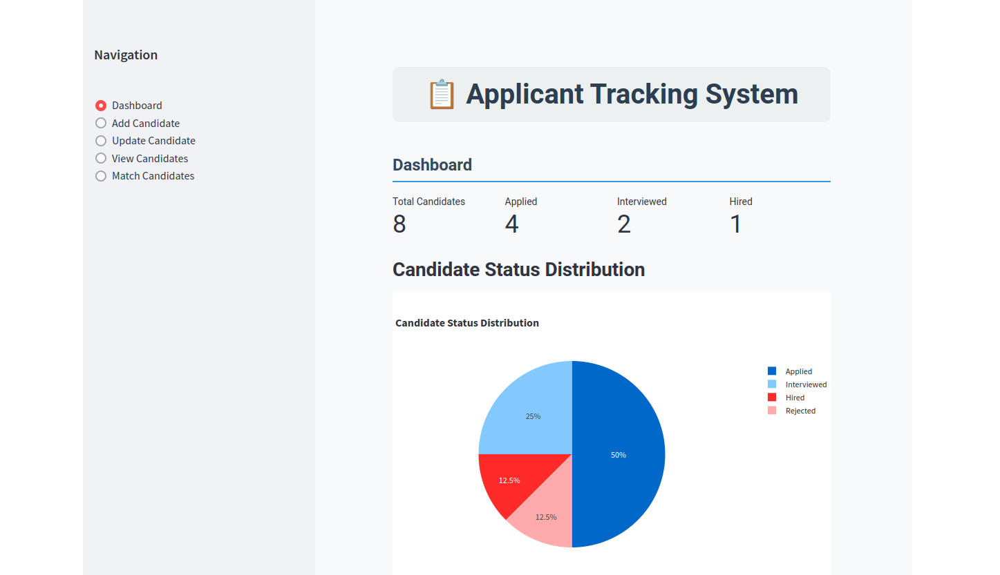

# Applicant Tracking System (ATS)

## Overview

The Applicant Tracking System (ATS) is a web application designed to efficiently manage job applications. The project consists of:

- **Backend**: Developed with Flask, this component provides a RESTful API to manage candidate data.
- **Frontend**: Built using Streamlit, this component provides a user-friendly interface to interact with the data.

## Prerequisites

- Docker
- Docker Compose

## Quick Start

1. **Clone the Repository:**

    ```bash
    git clone https://github.com/oliviertina29/ats.git
    cd ats
    ```

2. **Create and Activate a Virtual Environment:**

    ```bash
    source ats-env/bin/activate  # Use `ats\Scripts\activate` for Windows
    ```

3. Build and start the containers:
   ```
   docker-compose up --build
   ```

4. Access the application:
   - User Interface: http://localhost:8501
   - Backend API: http://localhost:5000

## Preview



## Features

- **Dashboard**: Provides an overview of key statistics, including total candidates, status distribution, and recent activities.
- **Add Candidate**: Fill out a form to add a new candidate with details such as name, email, resume, and status.
- **Update Candidate**: Modify the details of an existing candidate, including the ability to fetch current data before editing.
- **Delete Candidate**: Remove a candidate from the database.
- **View Candidates**: Display a list of all candidates with a sortable and searchable table.
- **Match Candidates with Job Description**: Submit a job description to receive a ranked list of candidates sorted by their relevance and suitability for the position based on their resumes.
- **Automated Scoring**: The ATS automatically evaluates and scores candidates based on keyword matching and skills relevant to the job description provided.
- **Data Visualization**: Includes charts and graphs to visualize candidate data, such as status distribution and candidates added per month.
- **Recent Activities Tracking**: Displays recent actions performed in the system, providing an audit trail of changes.
- **RESTful API Integration**: The backend is implemented using a RESTful API, allowing for seamless integration with various front-end applications or third-party tools.
- **User-friendly Interface**: Streamlit-based frontend provides an intuitive and responsive user interface.
- **Real-time Data Updates**: Dashboard and other views reflect real-time data from the database.

## Project Structure

```
ats/
│
├── ats-env/
│
├── backend/
│   ├── api.py
│   ├── Dockerfile
│   └── requirements.txt
│
├── frontend/
│   ├── app.py
│   ├── Dockerfile
│   └── requirements.txt
│
├── instance/
│   └── ats.db
│
├── docker-compose.yml
│
└── README.md                   # This file
```


## Contributions

Contributions are welcome! Please open an issue or submit a pull request for any enhancements or bug fixes.

## License

This project is licensed under the MIT License. See the [LICENSE](LICENSE) file for details.
